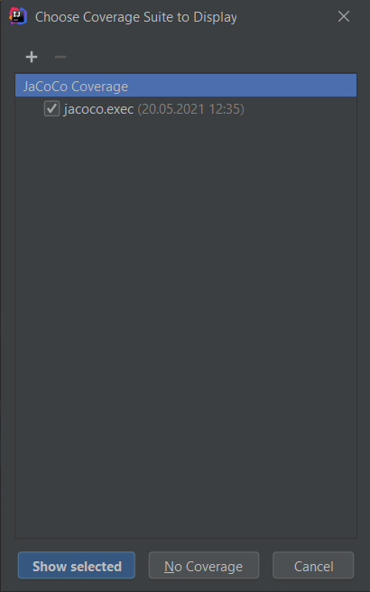

[](https://lgtm.com/projects/g/gen-classroom/projet-berney_forestier_herzig/alerts/)

[](https://lgtm.com/projects/g/gen-classroom/projet-berney_forestier_herzig/context:java)

(nous somme le groupe qui n'a pas pu clonner le repo pour la documentation)
Vous la trouvez mise à jour dans la branche main "Rapport.docx".

# projet-berney_forestier_herzig
Ce projet est réalisé durant le cours génie logiciel de la HEIG-VD.
Il met à disposition un générateur de sites statiques.

## Auteurs
  * Berney Alec
  * Forestier Quentin
  * Herzig Melvyn

# GitHub
## Langues
    * Branches -> En anglais  
    * Reste -> En français  
## Branches
**Branches d'un sprint:** sprint-x (avec x = 1,2,3,4)    
**Branches qui ajoutent une fonctionnalité:** ft\-feature\-desc  
**Branches qui résolvent un bug:** bg\-name\-of\-bug\-solved  

# Conventions de programmation

## Langues
  * Code -> En anglais
  * Commentaires -> En français

## Accolades
Toujours après un retour à la ligne
```
 if(...)
 {
      /* Du code */
 }
```
## Entête de fichier
```
/*
 -----------------------------------------------------------------------------------
 Cours       : Génie logiciel (GEN)
 Fichier     : <NomDuFichier>.h
 Auteur(s)   : Berney Alec & Forestier Quentin & Melvyn Herzig
 Date        : JJ.MM.AAAA
 -----------------------------------------------------------------------------------
 */
 ```
## Commentaires
Les classes et les méthodes sont commentées au format Javadoc.

### Classes 
 ```
/**
 * Description de la classe
 * @author auteur 1
 * @date jj-mm-aaaa
 */
  ```
 
### Méthodes
```
/**
 * Description de la méthode
 * @param param1 Description du premier paramètre.
 * @param param2 Description du second paramètre.
 * @return Que retourne la méthode..
 */
```

### Nommage
Tous les noms seront en camel case sauf pour les constantes où les espaces seront des ‘_’ et en majuscules.  
**Classe :** Première lettre en majuscule, MaClasse.java  
**Fonction :** Première lettre en minuscule, maFonction()  
**Ma constante :** final int UNE_CONSTANTE.

# Code coverage avec Jacoco
Le but de cette partie est d'explique comment récupérer / consulter le rapport de test de code coverage générer par Jacoco.
Tout d'abord, exécuter les test avec la commande: 

```
mvn clean install
```
Ouvrez Intellj avec le projet, cliquer en suite sur *Run -> Show Code Coverage Data*.
	


Selectionnez ensuite le rapport Jacoco et cliquez sur *Show selected*.
	


Vous pouvez maintenant naviguer dans le rapport de test:
	

